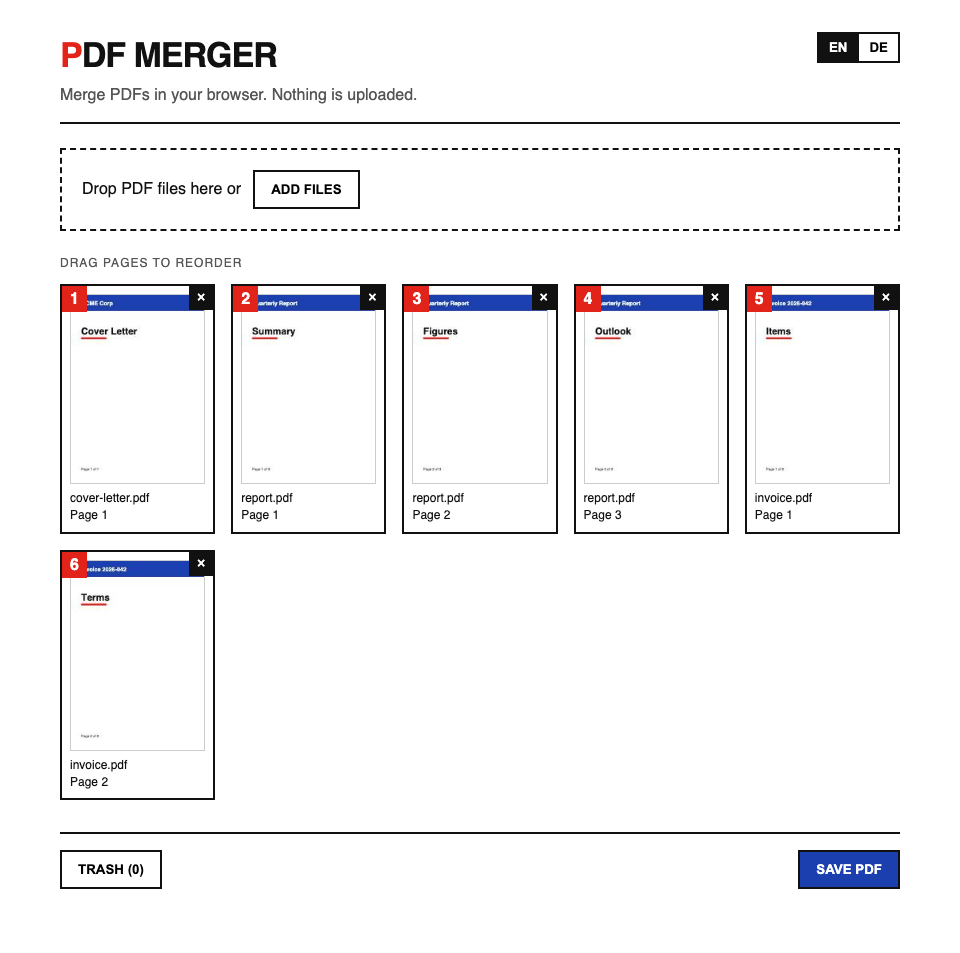
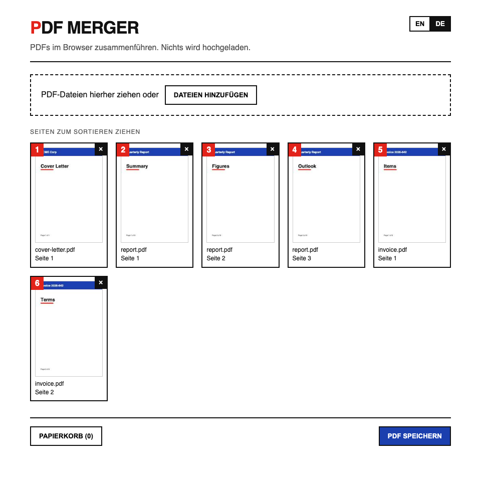

# PDF Merger

A PDF merger that runs **entirely in your browser**. Add PDFs, reorder pages by
drag-and-drop, drop the ones you don't need, and merge everything into a single
file. No file is ever uploaded — all processing happens locally, which is what
makes it safe to host as a static site on GitHub Pages.



Built with React + TypeScript, [pdf.js](https://mozilla.github.io/pdf.js/) for
page thumbnails and [pdf-lib](https://pdf-lib.js.org/) for merging. The UI follows
a minimal Bauhaus aesthetic (primary colours, hard edges, grotesque type) and the
entire stylesheet is a single short `src/style.css`.

## Features

- Add PDFs via button or drag-and-drop
- One thumbnail per page, numbered in output order
- Reorder pages by dragging
- Delete pages and restore them from the trash
- Merge and download as a single PDF
- German / English UI, easy to extend with more languages

## Getting started

Requires Node 18+.

```bash
npm install
npm run dev      # start the dev server at http://localhost:5173
npm run build    # production build into dist/
```

Some sample PDFs to play with live in [`examples/`](examples/); regenerate them
with `node examples/make-examples.mjs`.

## Tests

```bash
npm run typecheck     # tsc
npm test              # unit & component tests (Vitest + Testing Library)
npm run test:e2e      # end-to-end tests in a real browser (Playwright)
```

E2E fixtures are generated with `node e2e/make-fixtures.mjs` (committed PDFs).

## Adding a language

The German interface is just another JSON file:



1. Copy `src/i18n/en.json` to e.g. `src/i18n/fr.json` and translate the values.
2. Register it in `src/i18n/index.tsx`:

   ```ts
   import fr from "./fr.json";
   export const languages = { en, de, fr } as const;
   ```

The language switch and browser-language detection pick it up automatically.

## Deployment

Pushing to `main` runs `.github/workflows/deploy.yml`, which builds the app and
publishes `dist/` to GitHub Pages. Enable Pages once via the "GitHub Actions"
source in the repository settings.

## Legacy desktop app

The original PyQt6 desktop version lives in [`legacy/`](legacy/) and is no longer
maintained.

## Licence

MIT License - contributions are welcome.
